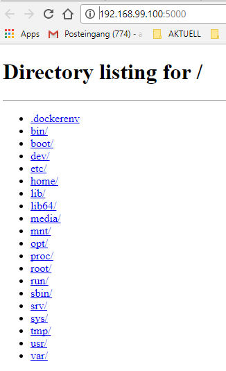

image::https://www.trivadis.com/sites/all/themes/custom/img/trivadis-logo.svg[http://trivadis.com]

== Getting started

=== Commands

Check the available docker commands

```
docker
```

* Whenever you don't remember a command, just type docker
* For more info, type `docker help COMMAND` (e.g. `docker help run`)


=== RUN a "Hello World" container

```
docker container run busybox echo "Hello World"
```

Let's review the structure of the command:

```bash
docker container run # executes command in a container
busybox              # container image to be used
echo "Hello World"   # command to run
```

The container image supplies the environment, including binaries with a shell that is running the command.
Speaking clear, so you are "not" using the host operating system shell, but the shell from busybox package,
when executing _docker container run_.

* If the Image is not cached, it pulls it automatically
* It prints `Hello World` and exits


=== RUN an interactive Container

Now let's start a container, open a console session in the container and execute some commands:

```
docker run -it busybox sh
  cat /etc/os-release
```

* **-i**: Keep stdin open even if not attached
* **-t**: Allocate a pseudo-tty


=== RUN a Container with a pipeline

Let's push some host output directly into the container using a pipeline. E.g. let's count the
words for a file:

```
$ cat /etc/fstab | docker run -i alpine wc -l
6
```

=== The container environment

Let's now take a look at process tree running in a container:

```bash
$ docker container run busybox ps uax
```

The result should look similar like this:

```bash
    1 root       0:00 ps uax
```

What you see:

* You are running the command as _root_, although this is not your regular root user but a very limited one.
* As you can see, the process runs in a very limited and isolated environment. The PID of the process is 1,
  so it does not see all other processes running on your host machine.

TIP: Also the _docker_ command itself is using environment variables to determine the target endpoint of the
     Docker container the command is communicating with:
     `DOCKER_CERT_PATH,DOCKER_TLS_VERIFY,DOCKER_HOST,DOCKER_MACHINE_NAME`


==== Envrionment variables

By default only a few environment variables are set. Also the environment is rather different from your host
environment:

```
$ docker container run busybox env
PATH=/usr/local/sbin:/usr/local/bin:/usr/sbin:/usr/bin:/sbin:/bin
HOSTNAME=1b0239cdec9c
```

Good thing is, you can extend the environment by passing explicit enviornment variable flags:

```bash
$ docker run -e MESSAGE="Hello World" busybox env
PATH=/usr/local/sbin:/usr/local/bin:/usr/sbin:/usr/bin:/sbin:/bin
HOSTNAME=8ee8ba3443b6
MESSAGE=Hello world
HOME=/root
```

==== The container file system

If we look at the container's file system we will see the OS directories are not here, as well:

```bash
$ docker container run busybox ls -l /home
total 0
```

==== The container Network

Networking in Docker containers is isolated, as well. Let's look at the interfaces inside a running container:

```bash
$ docker container run busybox ifconfig
eth0      Link encap:Ethernet  HWaddr 02:42:AC:11:00:02
          inet addr:172.17.0.2  Bcast:0.0.0.0  Mask:255.255.0.0
          inet6 addr: fe80::42:acff:fe11:2/64 Scope:Link
          UP BROADCAST RUNNING MULTICAST  MTU:1500  Metric:1
          RX packets:1 errors:0 dropped:0 overruns:0 frame:0
          TX packets:1 errors:0 dropped:0 overruns:0 carrier:0
          collisions:0 txqueuelen:0
          RX bytes:90 (90.0 B)  TX bytes:90 (90.0 B)

lo        Link encap:Local Loopback
          inet addr:127.0.0.1  Mask:255.0.0.0
          inet6 addr: ::1/128 Scope:Host
          UP LOOPBACK RUNNING  MTU:65536  Metric:1
          RX packets:0 errors:0 dropped:0 overruns:0 frame:0
          TX packets:0 errors:0 dropped:0 overruns:0 carrier:0
          collisions:0 txqueuelen:1
          RX bytes:0 (0.0 B)  TX bytes:0 (0.0 B)
```

We can use `-p` flag to forward a port on the host to the port 5000 inside the container:

```bash
$ docker container run -p 5000:5000 library/python:3.3 python -m http.server 5000
```

This command blocks because the server listens for requests, open a new tab and access the endpoint

*Linux/Mac*:
```bash
$ curl http://localhost:5000
<!DOCTYPE HTML PUBLIC "-//W3C//DTD HTML 4.01//EN" "http://www.w3.org/TR/html4/strict.dtd">
<html>
<head>
....
```

*Windows*:
```bash
$ explorer http://192.168.99.100:5000
```

NOTE: if +localhost+ or +192.168.99.100+ is not working run +docker-machine ip default+ to evaluate the correct ip of
your docker host machine.

If opened in a brwoser, you will see the directory listing:



Press `Ctrl-C` to stop the server container.


==== Daemons

Our last python server example obviously worked in foreground. But is is easy to run it as a background daemon task:

```bash
$ docker run -d -p 5000:5000 --name=webserver library/python:3.3 python -m http.server 5000
```

The flag `-d` instructs Docker to start the process in the background. Let's test if the server still works:

*Linux*:
```bash
curl http://localhost:5000
```
*Windows*:
```bash
$ explorer http://192.168.99.100:5000
```

As expected it is still running.


==== Inspecting running containers

We can use `container ls` command to view all running containers:

```bash
$ docker container ls
CONTAINER ID        IMAGE                 COMMAND                  CREATED             STATUS              PORTS                                              NAMES
387c1cdefa51        python:3.3            "python -m http.se..."   33 minutes ago      Up 33 minutes       0.0.0.0:5000->5000/tcp                             webserver
```

* Container ID - auto generated unique running id.
* Container image - image name.
* Command - linux process running as the PID 1 in the container.
* Created - when the container has been created.
* Status - the current runtime state.
* Ports - the network port settings.
* Ports - user friendly name of the container. You can name your containers, we did that by adding the `--name=webserver` flag.

We can use `logs` to view logs of a running container:

```bash
$ docker container logs webserver
```


==== Attaching to a running container**

We can execute a process that joins a container namespace using `exec` command:

```bash
$ docker container exec -ti webserver /bin/sh
```

We can then look around to see the process running as PID 1:

```bash
# ps uax
USER       PID %CPU %MEM    VSZ   RSS TTY      STAT START   TIME COMMAND
root         1  0.5  0.0  74456 17512 ?        Ss   18:07   0:00 python -m http.server 5000
root         7  0.0  0.0   4336   748 ?        Ss   18:08   0:00 /bin/sh
root        13  0.0  0.0  19188  2284 ?        R+   18:08   0:00 ps uax
#
```

This behaves as you would `ssh` into a container. However, there is no remote network connection.
The process `/bin/sh` started an instead of running in the host OS joined all namespaces of the container.

* `-t` flag attaches a terminal for interactive typing.
* `-i` flag attaches input/output from the terminal to the process. To best illustrate the impact of `-i` or
  `--interactive` in the expanded version, consider this example:

```bash
$ echo "Hallo!" | docker container run busybox grep Hallo
```

The example above won't work, because the container's input is not attached to the host stdout. The `-i` flag fixes that:

```bash
$ echo "Hallo!" | docker container run -i busybox grep Hallo
Hallo!
```


==== Starting and stopping containers

To stop and start container we can use `container stop` and `container start` commands:

```
$ docker container stop webserver
$ docker container start webserver
```

NOTE: Container names should be unique. Otherwise, you get an error when you try to create a new container with
a conflicting name.


<<<
image::https://www.trivadis.com/sites/all/themes/custom/img/trivadis-logo.svg[http://trivadis.com]

=== A bit of background

Effectively a Docker container is a set of linux processes that run isolated from the rest of the processes.
Hereby multiple linux subsystems help to implement the container concepts:

==== Namespaces

Namespaces create isolated stacks of linux primitives for a running process:

* _NET_ namespace creates a separate networking stack for the container, with its own routing tables and devices
* _PID_ namespace is used to assign isolated process IDs that are separate from host OS. For example, this is important if we want to send signals to a running
process.
* _MNT_ namespace creates a scoped view of a filesystem using [VFS](http://www.tldp.org/LDP/khg/HyperNews/get/fs/vfstour.html). It lets a container
to get its own "root" filesystem and map directories from one location on the host to the other location inside container.
* _UTS_ namespace lets container to get to its own hostname.
* _IPC_ namespace is used to isolate inter-process communication (e.g. message queues).
* _USER_ namespace allows container processes have different users and IDs from the host OS.

==== Control groups

Kernel feature that limits, accounts for, and isolates the resource usage (CPU, memory, disk I/O, network, etc.)

==== Capabilities

Capabilitites provide enhanced permission checks on the running process, and can limit the interface configuration,
even for a root user.

Refer to http://crosbymichael.com/creating-containers-part-1.html for additional low level details.


=== Other container operations

==== Importing Host Filesystem into a Container

What if we want to expose a directory from our host system into the container? For this we can use host volume mounts:

```
$ docker container run -v $(pwd):/home busybox ls -l /home
total 72
-rw-rw-r--    1 1000     1000         11315 Nov 23 19:42 LICENSE
-rw-rw-r--    1 1000     1000         30605 Mar 22 23:19 README.md
drwxrwxr-x    2 1000     1000          4096 Nov 23 19:30 conf.d
-rw-rw-r--    1 1000     1000          2922 Mar 23 03:44 docker.md
drwxrwxr-x    2 1000     1000          4096 Nov 23 19:35 img
drwxrwxr-x    4 1000     1000          4096 Nov 23 19:30 mattermost
-rw-rw-r--    1 1000     1000           585 Nov 23 19:30 my-nginx-configmap.yaml
-rw-rw-r--    1 1000     1000           401 Nov 23 19:30 my-nginx-new.yaml
-rw-rw-r--    1 1000     1000           399 Nov 23 19:30 my-nginx-typo.yaml
```

This command "mounted" our current working directory inside the container, so it appears to be "/home"
inside the container! All changes that we do in this repository will be immediately seen in the container's `home`
directory.

<<<
include::01-exercises.adoc[]


