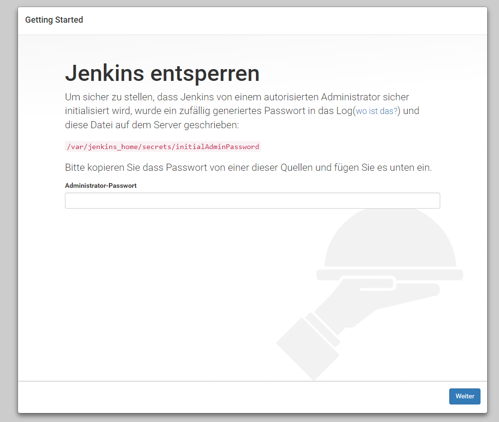
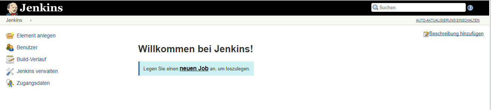

image::https://www.trivadis.com/sites/all/themes/custom/img/trivadis-logo.svg[http://trivadis.com]

== Using Docker with Jenkins

In this section we'll introduce different options to combine Docker and Jenkins.

=== Install Jenkins

First of all we need a running Jenkins instance:

[source,listing]
----
docker run -d -u root --name jenkins \
    -p 8080:8080 -p 50000:50000 \
    -v /root/jenkins:/var/jenkins_home \
    -v /var/run/docker.sock:/var/run/docker.sock \
    jenkins
----

To unlock the new Jenkins instance we need the password that is logged during startup:
[source,listing]
----
$ docker container logs jenkins
...
Jenkins initial setup is required. An admin user has been created and a password generated.
Please use the following password to proceed to installation:

d0f3abf70c064bb2ba3066942811dd66

This may also be found at: /var/jenkins_home/secrets/initialAdminPassword

*************************************************************
*************************************************************
*************************************************************
...
----

Then open the Jenkins dashboard at `http://${docker-machine ip default}:8080`.
Enter the unlock-password and continue the initial setup:

Install the default plugins and setup your user account. Finally
you are forwarded to the dashboard:

=== Install the Jenkins Docker Plugin

We also need to install the Jenkins Docker Plugin (https://wiki.jenkins-ci.org/display/JENKINS/Docker+Plugin):

* Within the Dashboard, select _Manage Jenkins_ on the left.
* On the Configuration page, select _Manage Plugins_.
* Manage Plugins page will give you a tabbed interface. Click _Available_ to view all the Jenkins
  plugins that can be installed.
* Using the _search box_, search for `Docker plugin`. There are multiple Docker plugins, select
  _Docker plugin_ using the checkbox.
* While on this page, install the _Git plugin_ for obtaining the source code from a Git repository.
* Click _Install without Restart_ at the bottom.
* The plugins will now be downloaded and installed. Once complete, click the link
  __Go back to the top pag__e.

=== Add the Docker Agent

Once the plugins have been installed, you can configure how they launch the Docker Containers.
The configuration will tell the plugin which Docker Image to use for the agent and which Docker
daemon to run the containers and builds on.

The plugin treats Docker as a cloud provider, spinning up containers as and when the build
requires them.

==== Configure the Plugin

This step configures the plugin to communicate with a Docker host/daemon.

* Once again, select __Manage Jenkins__.
* Select _Configure System_ to access the main Jenkins settings.
* At the bottom, there is a dropdown called _Add a new cloud_. Select `Docker` from the list.
* You can now configure the container options. Set the name of the agent to _docker-agent_.
* The "Docker URL" is where Jenkins launches the agent container. In this case, we'll use the same
  daemon as running Jenkins, but you could split the two for scaling. Enter the
  URL tcp://${docker-machine ip default}:2345
* Use _Test Connection_ to verify Jenkins can talk to the Docker Daemon. You should see the Docker version number
  returned.

==== Configure the Image

Our plugin can now communicate with Docker. In this step, we'll configure how to launch the Docker
Image for the agent.

* Using the Images dropdown, select _Add Docker Template_ dropdown.
* For the Docker Image, use _benhall/dind-jenkins-agent_. This image is configured with a Docker client and available at https://hub.docker.com/r/benhall/dind-jenkins-agent/
* To enable builds to specify Docker as a build agent, set a label of _docker-agent_.
* Jenkins uses SSH to communicate with agents. Add a new set of _Credentials_. The username is
  `jenkins` and the password is `jenkins`.
* Finally, expand the Container Settings section by clicking the button. In the _Volumes_ text box
  enter `/var/run/docker.sock:/var/run/docker.sock`
* Click _Save_.

Jenkins can now start a Build Agent as a container when required.

==== Build a Docker Image using Jenkins

This step creates a new project, which Jenkins will build via our new agent. The project source
code is at https://github.com/katacoda/katacoda-jenkins-demo. The repository has a Dockerfile;
this defines the instructions on how to produce the Docker Image. Jenkins doesn't need to know
the details of how our project is built.

* On the Jenkins dashboard, select _Create new jobs_
* Give the job a friendly name such as `Jenkins Docker Demo` and select _Freestyle project_.
* The build will depend on having access to Docker. Using the "_Restrict where this project can be run_"
  we can define the label we set of our configured Docker agent. The set _Label Expression_ to `docker-agent`.
  You should have a configuration of `Label is serviced by no nodes and 1 cloud`.
* Select the _Repository type_ as `Git` and set the Repository to be https://github.com/katacoda/katacoda-jenkins-demo.
  If `Git` is not in the "Source Code Management" list, you need to install the Git plugin as mentioned in step 2.
* We can now _add a new Build Step_ using the dropdown. Select `Execute Shell`.
* Because the logical of how to build is specified in our `Dockerfile`, Jenkins only needs to call build and
  specify a friendly name. In this example, use the following commands.

[source,listing)
----
docker info
docker image build -t dockerday/jenkins-demo:${BUILD_NUMBER} .
docker image tag dockerday/jenkins-demo:${BUILD_NUMBER} dockerday/jenkins-demo:latest
docker image ls
----

The first stage lists all the files in the directory which will be built. When calling
_docker image build_ we use the Jenkins build number as the image tag. This allows us to
version our Docker Images. We also tag the build with latest.

At this point, or in an additional step, you could execute a _docker image push_ to upload the
image to a centralised Docker Registry.

Our build is now complete. Click _Save_.

We now have a configured job that will build Docker Images based on our Git repository. The next
stage is to test and try it.

*Start the build*

On the left-hand side, select _Build Now_. You should see a build scheduled with a message
"(pending—Waiting for next available executor)".

NOTE: In the background, Jenkins is launching the container and connecting to it via SSH.
     Sometimes this can take a moment or two.

You can see the progress using `docker container logs --tail=10 jenkins`

*And finally the build fails. Why?* Because Docker CLI is not available on the default Jenkins Agent
Image. So we have several options how we can fix this:

. Because we are running Jenkins in a docker container we _map the hosting container's `${which docker}`_ to
  `/usr/local/bin/docker`. We also must configure the Docker CLI client it's target `DOCKER_HOST`.
  This can be done by setting the corresponding environment variable with the IP address
  (accessible) from the Jenkins agent created (or by applying the corresponding the Jenkins Docker
  plugin setting). Alternatively we can also remap `/var/run/docker.socket` into the Jenkins agent
  container. The ladder will also require to execute the Jenkins agent in `privileged` mode.
. _Build an extended Jenkins Agent image_, where also Docker CLI is installed out of the box. Based
  on the first workshop contents, you should know how ;-) Similarly you have to make the Docker container
  running outside the Jenkins agent acessible by setting `DSOCKER_HOST` and optionally mapping the
  `/var/run/docker.socket` into the agents container image.
. Finally you can even try to _run Docker inside in your agent_. Similar as before you have to add the
  Docker tooling to your image. But now instead of redirecting the CLI outside your agent's container
  you start the docker environment in your image to make the work. Running a setup like this is
  known as "Running Docker in Docker". Unfortunately it is not recommended since, it has a set of
  disadvantages.

IMPORTANT: Mapping of the Docker binary will not work, when running in a Windows Toolbox based setup.
           The ${which docker} command evaluates to a Windows path, which is not resolable in the target
           environment. So the first solution described above will never work under Windows.

NOTE:      Further details on running Docker in Docker can be found at
           https://jpetazzo.github.io/2015/09/03/do-not-use-docker-in-docker-for-ci/

==== Jenkins workflows

Jenkins also has an extension called _Jenkins workflow plugin_, which gives you a powerful tool to
configure any kind of customized workflows. So it should be rather easy to define a build stop, which actually
uses this workflow functionality:

We will revisit the Jenkins workflow functionality in the second part of this workshop.